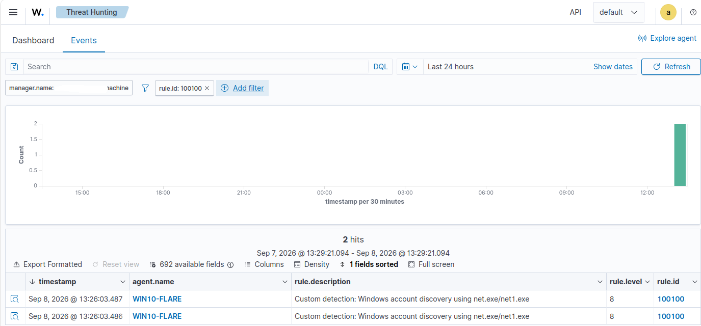
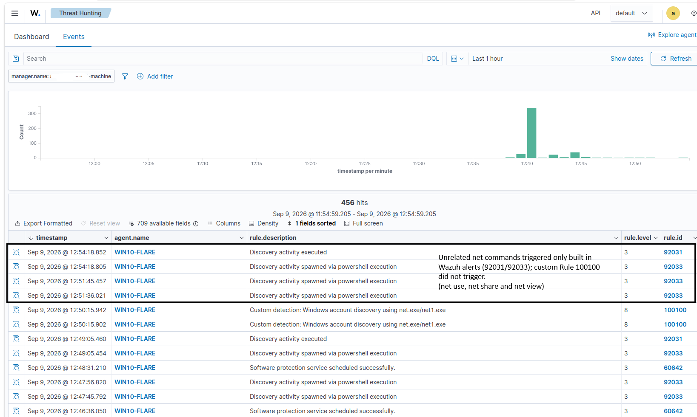
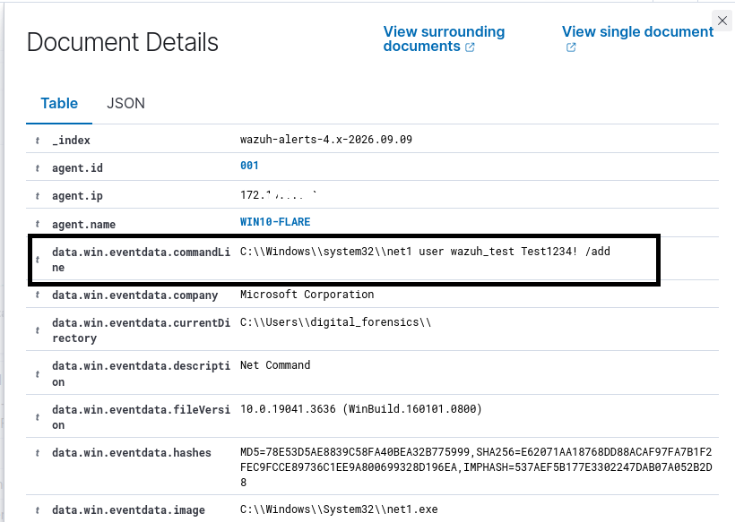
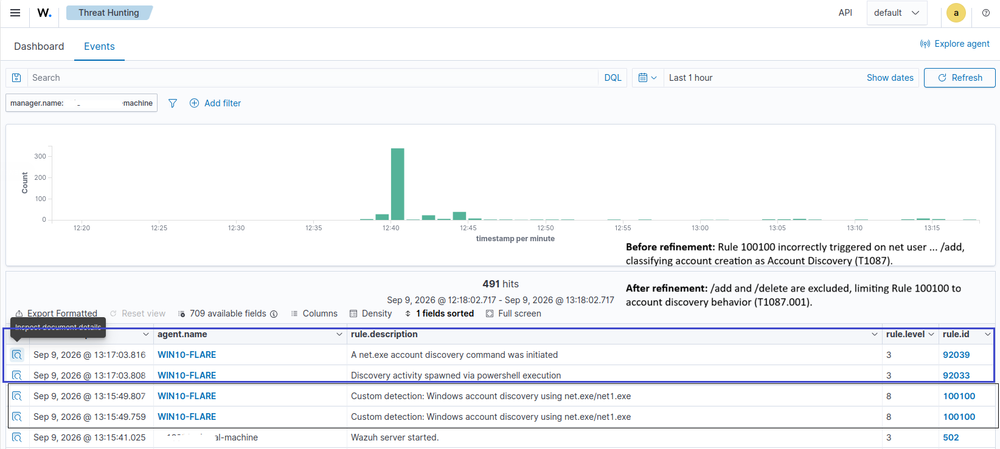

# T1087.001 - Account Discovery: Local Account

## Overview

This detection identifies Windows local account enumeration performed using the native `net.exe` or `net1.exe` utilities.

Account discovery can be used by an attacker after gaining access to a Windows system to understand what local accounts exist on the system.

This lab demonstrates the complete detection engineering workflow:

```text
Generate Activity
      ↓
Collect Telemetry
      ↓
Analyze Sysmon Event
      ↓
Review Existing Detection
      ↓
Develop Custom Rule
      ↓
Validate Rule
      ↓
Positive Testing
      ↓
Negative Testing
      ↓
Identify Detection Gap
      ↓
Refine Detection
      ↓
Regression Testing
      ↓
Map to MITRE ATT&CK
```

---

## MITRE ATT&CK

| Field | Value |
|---|---|
| Technique | Account Discovery: Local Account |
| Technique ID | T1087.001 |
| Tactic | Discovery |
| Platform | Windows |

---

## Data Source

Sysmon is used as the endpoint telemetry source.

Relevant event:

```text
Sysmon Event ID 1 - Process Create
```

Relevant Wazuh fields:

```text
win.eventdata.image
win.eventdata.commandLine
win.eventdata.parentImage
```

---

## Test Activity

The following command was executed on the monitored Windows endpoint:

```powershell
net user
```

This enumerates Windows user accounts.

The test was performed only inside the isolated lab environment.

---

## Sysmon Telemetry

Sysmon generated:

```text
Event ID: 1
Event Type: Process Create
Provider: Microsoft-Windows-Sysmon
```

During testing, the resulting event contained process information similar to:

```text
Image:
C:\Windows\SysWOW64\net1.exe

CommandLine:
C:\Windows\system32\net1 user
```

This demonstrated an important detection engineering concept:

> The command entered by the user is not always identical to the executable or command line observed in endpoint telemetry.

For example, executing:

```powershell
net user
```

resulted in telemetry involving:

```text
net1.exe
```

This observation influenced the custom detection logic. Matching only `net.exe` could miss the activity observed in the actual endpoint telemetry.

---

## Existing Wazuh Detection

Before developing a custom rule, the activity was tested against the default Wazuh ruleset.

Wazuh generated detections including:

```text
Rule 92031
Discovery activity executed
```

and:

```text
Rule 92033
Discovery activity spawned via powershell execution
```

The event was associated with Account Discovery activity.

This established a baseline before implementing the custom detection.

---

## Initial Custom Detection Logic

The initial custom Wazuh rule was designed to detect:

1. A Sysmon Process Creation event.
2. Execution of `net.exe` or `net1.exe`.
3. A command line containing the `user` argument.

The rule uses:

```xml
<if_group>sysmon_event1</if_group>
```

to limit evaluation to Sysmon Process Creation events.

The executable condition:

```regex
(?i)\\net1?\.exe$
```

matches:

```text
net.exe
net1.exe
```

The command-line condition:

```regex
(?i)\buser\b
```

looks for the `user` argument.

---

## Initial Custom Wazuh Rule

Rule ID:

```text
100100
```

Severity:

```text
Level 8
```

The initial rule successfully detected:

```powershell
net user
```

The complete rule is available in:

```text
rule.xml
```

---

## Rule Validation

Before restarting the Wazuh manager, the ruleset was validated using:

```bash
sudo /var/ossec/bin/wazuh-analysisd -t
```

No configuration errors were reported.

The Wazuh manager was then restarted:

```bash
sudo systemctl restart wazuh-manager
```

Its status was verified using:

```bash
sudo systemctl status wazuh-manager
```

The manager successfully returned to an active and running state.

---

## Positive Detection Test

The discovery activity was generated again:

```powershell
net user
```

Wazuh Threat Hunting was used to verify the resulting alert.

The custom alert successfully appeared:

```text
Rule ID: 100100
Level: 8
Description: Custom detection: Windows account discovery using net.exe/net1.exe
```

This confirmed that the custom rule detected the intended account discovery activity.



---

## Negative Testing

Detection engineering requires verifying not only that suspicious activity triggers a rule, but also that unrelated activity does not.

The following `net` commands were therefore tested:

```powershell
net use
net view
net share
```

These commands did not trigger custom rule `100100`.



### Test Results

| Command | Rule 100100 Triggered? | Result |
|---|---:|---|
| `net user` | Yes | Expected |
| `net use` | No | Expected |
| `net view` | No | Expected |
| `net share` | No | Expected |

This confirmed that the `\buser\b` condition prevented the custom rule from triggering on unrelated `net.exe`/`net1.exe` activity.

---

## Detection Gap Discovered

Additional testing revealed that the initial rule was too broad.

The following command was executed:

```powershell
net user wazuh_test Test1234! /add
```

This command creates a local Windows account rather than enumerating existing accounts.

However, the original Rule `100100` still triggered:

```text
Custom detection: Windows account discovery using net.exe/net1.exe
```

The observed command-line telemetry was:

```text
C:\Windows\system32\net1 user wazuh_test Test1234! /add
```

The cause was the original command-line condition:

```regex
(?i)\buser\b
```

The command contained the word `user`, so it satisfied the detection condition even though the operation being performed was account creation rather than account discovery.

---

## ATT&CK Mapping Issue

The test exposed an important detection-mapping problem.

The command:

```powershell
net user
```

performs account discovery and is appropriately associated with:

```text
T1087.001 - Account Discovery: Local Account
```

However:

```powershell
net user wazuh_test Test1234! /add
```

creates a local account.

```text
_index      wazuh-alerts-4.x-2026.09.09
agent.id    001
agent.ip    172.x.x.x
agent.name  WIN10-FLARE
data.win.eventdata.commandLine    C:\\Windows\\system32\\net1 user wazuh_test Test1234! /add
rule.id     100100
rule.level   8

_index      wazuh-alerts-4.x-2026.09.09
agent.id    001
agent.ip    172.x.x.x
agent.name  WIN10-FLARE
data.win.eventdata.commandLine    C:\\Windows\\system32\\net1 user
rule.id     100100
rule.level   8
```


Account creation is different behavior and should not be classified by this discovery rule.

Therefore, allowing `/add` operations to trigger Rule `100100` would make the rule's ATT&CK mapping less precise.

---

## Detection Refinement

The rule was refined to exclude account-management operations containing `/add` or `/delete`.

The following condition was added:

```xml
<field name="win.eventdata.commandLine"
       type="pcre2"
       negate="yes">(?i)/(add|delete)\b</field>
```

The refined detection logic therefore requires:

```text
Sysmon Event ID 1
        +
net.exe OR net1.exe
        +
"user" in command line
        +
NOT /add or /delete
```

The MITRE ATT&CK mapping was also made more specific:

```text
T1087
   ↓
T1087.001 - Account Discovery: Local Account
```

---

## Refined Wazuh Rule

```xml
<rule id="100100" level="8">
  <if_group>sysmon_event1</if_group>

  <field name="win.eventdata.image"
         type="pcre2">(?i)\\net1?\.exe$</field>

  <field name="win.eventdata.commandLine"
         type="pcre2">(?i)\buser\b</field>

  <field name="win.eventdata.commandLine"
         type="pcre2"
         negate="yes">(?i)/(add|delete)\b</field>

  <description>Custom detection: Windows account discovery using net.exe/net1.exe</description>

  <mitre>
    <id>T1087.001</id>
  </mitre>
</rule>
```

---

## Regression Testing

After modifying the rule, the Wazuh ruleset was validated and the manager was restarted.

The original discovery command was executed again:

```powershell
net user
```

Rule `100100` continued to trigger successfully.

This confirmed that the refinement did not break the intended detection.

The account-creation scenario was then retested to verify that account-management behavior was excluded from the discovery rule.





### Expected Detection Behavior

| Command | Expected Rule 100100 Result |
|---|---|
| `net user` | Trigger |
| `net use` | No trigger |
| `net view` | No trigger |
| `net share` | No trigger |
| `net user <username> <password> /add` | No trigger |
| `net user <username> /delete` | No trigger |

---

## Detection Pipeline

```text
net user
    │
    ▼
Windows Process Execution
    │
    ▼
Sysmon Event ID 1
    │
    ▼
Windows Event Log
    │
    ▼
Wazuh Agent
    │
    ▼
Wazuh Manager
    │
    ▼
Custom Rule 100100
    │
    ▼
MITRE ATT&CK T1087.001
    │
    ▼
Threat Hunting Alert
```

---

## Result

The custom detection successfully identified Windows local account discovery performed using `net.exe`/`net1.exe`.

Testing also demonstrated that detection development requires more than confirming that a rule fires.

Negative and edge-case testing identified that the initial detection also classified account creation as account discovery. Inspection of the actual Sysmon command-line telemetry showed why the rule matched, and the detection was subsequently refined to exclude `/add` and `/delete` operations.

The final testing process demonstrated:

```text
Telemetry Analysis
       ↓
Detection Development
       ↓
Positive Testing
       ↓
Negative Testing
       ↓
False Classification Identified
       ↓
Rule Refinement
       ↓
Regression Testing
```

This validated the detection pipeline while improving the precision of the custom rule and its MITRE ATT&CK mapping.

---

## Detection Limitations

This rule specifically targets local account discovery using:

```text
net user
net1 user
```

An attacker could perform account discovery using other mechanisms, including:

- PowerShell
- WMI
- LDAP queries
- Windows APIs
- Other administrative utilities

The detection also focuses primarily on command-line patterns. Additional context such as parent processes, user identity, execution frequency, and surrounding activity could improve detection fidelity.

Therefore, this rule should be considered one detection method for `T1087.001` rather than comprehensive coverage of the technique.

---

## Future Improvements

Potential improvements include:

- Detect PowerShell-based account enumeration.
- Detect additional account discovery utilities.
- Distinguish local and domain account discovery.
- Analyze parent/child process relationships.
- Add allowlists or contextual logic for legitimate administrative activity.
- Develop a separate detection for local account creation.
- Map account creation behavior to `T1136.001`.
- Compare multiple T1087.001 detection strategies.
- Test additional false-positive and edge-case scenarios.

---

## Key Takeaways

1. Detection rules should be based on **observed endpoint telemetry**, not only on the command entered by the user.
2. `net user` activity may appear as `net1.exe` in Sysmon telemetry.
3. Positive testing alone is insufficient; negative testing helps identify overly broad detections.
4. Similar command syntax can represent different attacker behaviors.
5. Detection logic and MITRE ATT&CK mappings should accurately represent the behavior being detected.
6. Detection engineering is an iterative process of testing, analyzing, refining, and retesting.