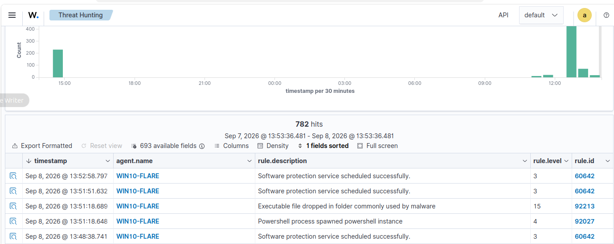
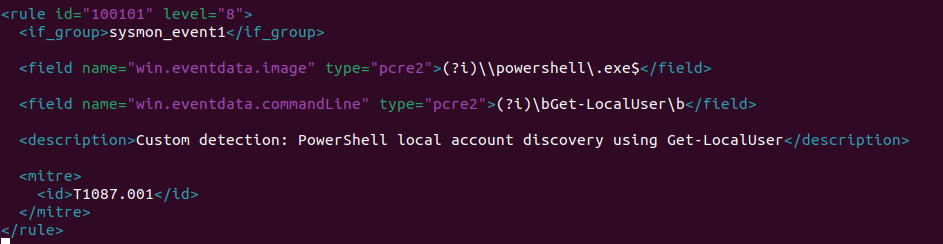
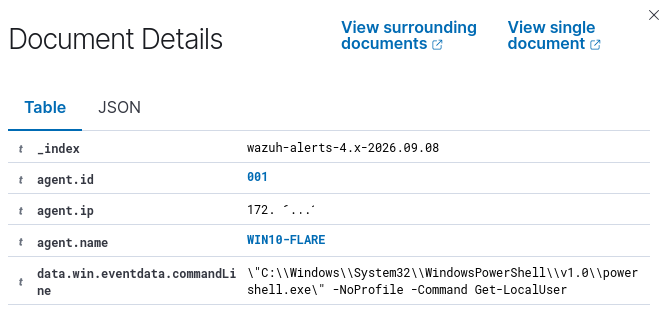
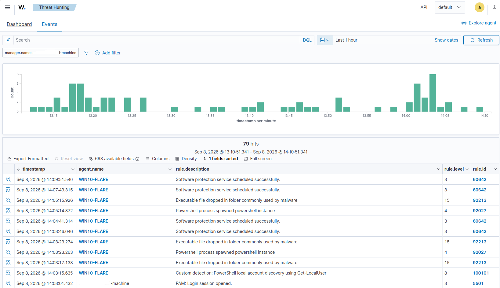
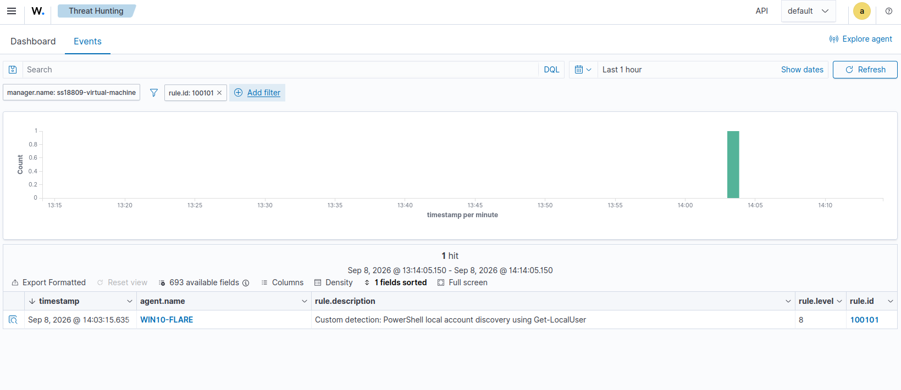

# PowerShell Local Account Discovery Detection

## Overview

This detection identifies local account discovery performed through PowerShell using the `Get-LocalUser` cmdlet.

The goal of this lab was to develop a more targeted PowerShell detection rather than alerting on every PowerShell execution.

The detection engineering workflow included:

```text
Generate Activity
      ↓
Analyze Sysmon Telemetry
      ↓
Review Existing Wazuh Detection
      ↓
Develop Custom Rule
      ↓
Validate Rule
      ↓
Positive Test
      ↓
Negative Test
      ↓
MITRE ATT&CK Mapping
```

---

## MITRE ATT&CK

| Field | Value |
|---|---|
| Technique | Account Discovery: Local Account |
| Technique ID | T1087.001 |
| Tactic | Discovery |
| Platform | Windows |

PowerShell itself is also associated with:

```text
T1059.001 - Command and Scripting Interpreter: PowerShell
```

However, the custom rule is mapped to `T1087.001` because the behavior being detected is specifically local account enumeration.

---

## Data Source

The detection uses:

```text
Sysmon Event ID 1 - Process Create
```

Relevant Wazuh fields:

```text
win.eventdata.image
win.eventdata.commandLine
win.eventdata.parentImage
win.eventdata.parentCommandLine
```

---

## Test Activity

The following command was executed on the monitored Windows endpoint:

```powershell
powershell.exe -NoProfile -Command "Get-LocalUser"
```

`Get-LocalUser` enumerates local Windows user accounts.

The test was performed only inside the isolated detection-engineering lab.

---

## Observed Sysmon Telemetry

Sysmon generated a Process Creation event:

```text
Event ID: 1
Provider: Microsoft-Windows-Sysmon
```

Relevant telemetry included:

```text
Image:
C:\Windows\System32\WindowsPowerShell\v1.0\powershell.exe
```

```text
CommandLine:
"C:\Windows\System32\WindowsPowerShell\v1.0\powershell.exe" -NoProfile -Command Get-LocalUser
```

The parent process was also PowerShell:

```text
ParentImage:
C:\Windows\System32\WindowsPowerShell\v1.0\powershell.exe
```

This occurred because the test command launched another PowerShell process from an existing PowerShell session.

---

## Existing Wazuh Detection

Before creating the custom rule, Wazuh's built-in rules detected the PowerShell process relationship.

Observed alert:

```text
Rule ID: 92027
Description: Powershell process spawned powershell instance
Level: 4
```


MITRE mapping:

```text
T1059.001 - PowerShell
```

This detection identifies PowerShell execution behavior but does not specifically identify the `Get-LocalUser` account-discovery activity.

---

## Detection Objective

A custom rule was created with more specific logic.

The detection requires:

1. A Sysmon Process Creation event.
2. The executable to be `powershell.exe`.
3. The command line to contain `Get-LocalUser`.

Detection logic:

```text
Sysmon Event ID 1
        AND
powershell.exe
        AND
Get-LocalUser
        ↓
Custom Rule 100101
```

This prevents the rule from alerting on every PowerShell execution.

---

## Custom Rule

The custom Wazuh rule uses:

```text
Rule ID: 100101
Level: 8
```

The executable condition:

```text
(?i)\\powershell\.exe$
```

matches PowerShell regardless of capitalization.

The command-line condition:

```text
(?i)\bGet-LocalUser\b
```

requires the `Get-LocalUser` cmdlet to appear as a complete term in the command line.

MITRE mapping:

```text
T1087.001 - Account Discovery: Local Account
```

The complete detection is available in:

```text
rule.xml
```



---

## Rule Validation

Before activating the rule, the Wazuh ruleset was validated using:

```bash
sudo /var/ossec/bin/wazuh-logtest
```

The ruleset loaded successfully without configuration errors.

The Wazuh manager was then restarted:

```bash
sudo systemctl restart wazuh-manager
```

The service status was verified:

```bash
sudo systemctl status wazuh-manager --no-pager
```

---

## Positive Test

The following activity was generated:

```powershell
powershell.exe -NoProfile -Command "Get-LocalUser"
```

Wazuh successfully generated:

```text
Rule ID: 100101
Level: 8

Custom detection: PowerShell local account discovery using Get-LocalUser
```



### Result

```text
Get-LocalUser → Rule 100101 → ALERT
```

**Result: PASS**



---

## Negative Test

To determine whether the rule simply detected all PowerShell executions, a benign PowerShell command was executed:

```powershell
powershell.exe -NoProfile -Command "Get-Date"
```

Wazuh continued to observe PowerShell activity through its built-in rules, but custom Rule `100101` did not fire.



### Result

```text
Get-Date → Rule 100101 → NO ALERT
```

**Result: PASS**

---

## Test Results

| Test | Expected | Result |
|---|---|---|
| `Get-LocalUser` | Alert | PASS |
| `Get-Date` | No custom alert | PASS |

The negative control demonstrates that Rule `100101` does not trigger merely because PowerShell was executed.

---

## Detection Pipeline

```text
PowerShell
    │
    │ Get-LocalUser
    ▼
Sysmon Event ID 1
    │
    ▼
Windows Event Log
    │
    ▼
Wazuh Agent
    │
    ▼
Wazuh Manager
    │
    ▼
Rule 100101
    │
    ▼
T1087.001
    │
    ▼
Threat Hunting Alert
```

---

## Detection Limitations

This rule specifically detects PowerShell execution where the command line contains:

```text
Get-LocalUser
```

It does not provide complete coverage for local account discovery.

Alternative techniques may include:

- `net user`
- `net1 user`
- WMI
- ADSI
- Windows APIs
- Other PowerShell cmdlets
- Obfuscated PowerShell
- Encoded commands

An attacker may also modify or obfuscate the command in ways that prevent a simple command-line match.

---

## Future Improvements

Potential improvements include:

- Detect additional PowerShell account-enumeration methods
- Detect encoded or obfuscated PowerShell
- Correlate PowerShell with subsequent discovery activity
- Analyze parent-child process relationships
- Add legitimate administrator allowlisting
- Test additional negative controls
- Compare command-line detection with PowerShell Script Block Logging
- Evaluate false positives from legitimate administrative activity